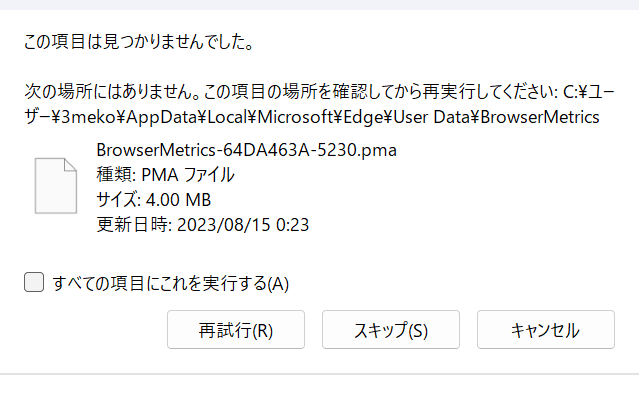

# Auto Twitter v2

## v2プロジェクトのクローズ

機能をモジュール化し、スキーマもソースコードもかなり最適化した。  
しかし、挙動をシステマチックにした結果、検知されロックされてしまった。  
そのため、v2のプロジェクトはクローズします。  
しかし、後継として、極限まで人間の挙動に近いver3.0のプロジェクトを立てますので乞うご期待。

## Error resolution

### Edgeのユーザーをコピーするとき

#### エラー内容
デフォルトのユーザーをコピーするときに、毎回↓のエラーが出る  

このファイルは、ログインしたときのキャッシュとかが残っている。  
そのため、ちゃんとコピーしないと、twitterにログインした状態でedgeを開くことができない。

#### 解決法

以下のパスにファイル自体は存在するので、個別でコピーすればよい

~~~bash
C:\Users\3meko\AppData\Local\Microsoft\Edge\User Data\BrowserMetrics\BrowserMetrics-XXXXXXXX-XXXX.pma
~~~